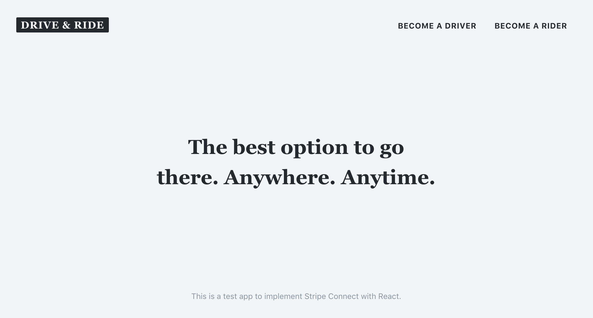

# React Stripe App Example

## Description

React app example implementing Stripe Connect using Next.js and React Final Form.

## Getting Started

If you are interested to implement Stripe Connect in your app, you should take a look at this example. Using tokens have some benefits. Tokens are the recommended way because they are the safest way to work. The links below could be very useful to understand everything better about tokens.

* [Stripe.js](https://stripe.com/docs/stripe-js)
* [Security](https://stripe.com/docs/security)
* [Tokens (API)](https://stripe.com/docs/api#tokens)

This app example will implement:

* [x] Account tokens
* [x] Bank account tokens
* [ ] PII (Personally Identifiable Information) tokens
* [ ] File uploads for identity documents

In addition, it is a good opportunity to master and see a more complex use case about handling forms with React Final Form.

* [x] Conditional fields
* [x] Reusable field groups
* [x] Array of fields (additional owners)
* [x] Usage of different fields (input, select, etc)
* [x] Rendering dynamic fields (based in countries and legal entity types)
* [ ] Validation

## More In Detail

### Account tokens

[Read more about account tokens](https://stripe.com/docs/connect/account-tokens) on the official Stripe Docs.

* Collect legal entity details
* Indicating acceptance of the Stripe Connected Account Agreement (only when creating a Stripe connected account)

The process is very easy to understand:

1.  Collect the necessary information
2.  Send it to Stripe
3.  Stripe returns a token for that information
4.  Send the token to your server
5.  Create or update the Stripe connected account in your server side

### Bank account tokens

Collect bank account details as payout methods.

### PII (Personally Identifiable Information) tokens

TODO
